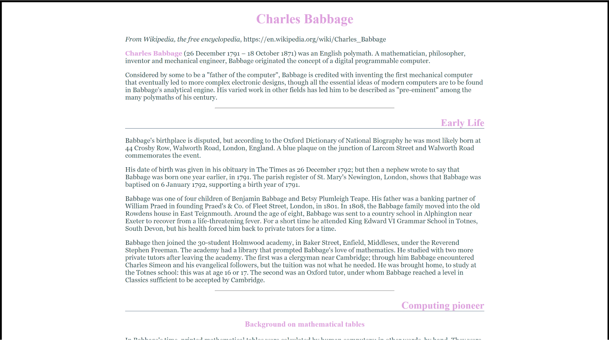

Web Lab 03 &ndash; CSS I
==========

Begin by forking this repository into your namespace by clicking the ```fork``` button above, then selecting your username from the resulting window. Once completed, click the ```clone``` button, copy the ```Clone with HTTPS``` value. Open IntelliJ, and from the welcome screen click ```Check out from Version Control -> Git```, then paste the copied URL into the ```URL``` field of the resulting window. Provide your GitLab username and password if prompted.

Explore the files in the project, familiarizing yourself with the content.

When complete, demonstrate your code to your tutor. This must be verified with your tutor by the end of the week.


Exercise One
----------

From the  the ```ictgradschool/web/lab03/ex01 folder```, locate and modify the file ```tim_berners_lee.html``` so that it links to the external style sheet ```style1.css```. 

Notice how adding a stylesheet can have a dramatic effect, despite changing only a single element in the original html file through adding the ```<link>``` tag.

Modify ```grace_hopper.html``` to link ```style2.css```. Preview again to see how including the named style file changes this particular page.

Neither style may look particularly attractive, but they do look different. Notice how different both these otherwise basic pages look to each other, merely by adding a different style sheet to each. Compare them both with the unstyled ```charles_babbage.html``` file.


Exercise Two
----------

Make a copy of the files in the ```ictgradschool/web/lab03/ex01``` folder and place them in the ```ictgradschool/web/lab03/ex02``` folder. You may need to create this folder yourself. Close all open editor tabs, then when opening files to edit, open them from the ex02 folder.
 
Edit ```style2.css``` to achieve the following:
- Change the background colour of the entire page to DarkSalmon (#E9967A)
- Make the font in the paragraph 25% bigger (hint: at present they're at 100% size)
- Make all the headings OrangeRed

Preview the updated ```grace_hopper.html``` page that makes use of ```style2.css``` and make sure you can see the changes you have made.


Exercise Three
----------

Make a copy of the files in the ```ictgradschool/web/lab03/ex02``` folder and place them in the ```ictgradschool/web/lab03/ex03``` folder. You may need to create this folder yourself. Close all open editor tabs, then when opening files to edit, open them from the ex03 folder.
 
 Now you'll write a CSS style sheet file from scratch. Call it ```external_style.css``` and link it into ```charles_babbage.html```. Write the style rules that are necessary to make the page look as follows (ignore the black outer border of the screenshot, which is merely to indicate where the browser screen ends so you can see the padding whitespace):



Your CSS should define the following:
- Padding of 20% (of the total width) to the left and to the right of the body
- All headings, and any bold/strong elements need to be in the colour Plum
- Any heading 1 and heading 3 is to be centred (heading 3 is not visible in the above screenshot)
- Any heading 2 is to be right aligned
- Any heading 2 should furthermore have a line underneath of the colour LightSlateGray
- Horizontal rules ```<hr>``` are LightSlateGray too, but are dotted and thin, 
- An entire horizontal rule should take up only 50% of the width available
- Paragraph text should be DarkSlateGray in colour and should be in the Georgia font, but if no Georgia is available then paragraphs should fall back on using any serif font


Exercise Four
----------

Make a copy of the files in the ```ictgradschool/web/lab03/ex03``` folder and place them in the ```ictgradschool/web/lab03/ex04``` folder. You may need to create this folder yourself. Close all open editor tabs, then when opening files to edit, open them from the ex04 folder.
 
Now use the ```external_style.css``` file that you just created as the external style sheet for all three HTML files and preview them all.

Next, add the following style rules to your paragraph styling:

```
text-align: justify;
font-style: italic;
```

And add some extra top and bottom padding to the body of all your pages too, as it feels too cramped vertically, by getting rid of any existing padding style rules on the body and replacing them with:

```
padding: 50px 20%;
```

You'll learn this in more detail later, but the above sets vertical padding (top and bottom) to 50 pixels and sets the horizontal padding (left and right) to 20% of the width available for the body.

Preview all the files. They should all have changed accordingly. This is the advantage of bringing together all your styles into an external style sheet that is linked in from many web pages: you make the change once, and they all update together and retain a consistent look.


Exercise Five
----------

Make a copy of the files in the ```ictgradschool/web/lab03/ex04``` folder and place them in the ```ictgradschool/web/lab03/ex05``` folder. You may need to create this folder yourself. Close all open editor tabs, then when opening files to edit, open them from the ex05 folder.
  
Add an internal style sheet to tim_berners_lee.html that:
- Overrides the Plum colour used for headings and for bold/strong text, to use a SteelBlue colour instead
- Sets the background colour for this page to use ```#eeeeee```, which defines a light grey

Don't remove the ```<link>``` to the external style sheet, but add your internal styling thereafter instead. This way, you get all the styling in your external style sheet and override with any specific style changes you make in that particular HTML file.

Check some of your other HTML pages to confirm they haven't changed: you've only overridden the style of ```tim_berners_lee.html``` by adding an internal style sheet to it; you've not changed the external style sheet that they all used.

Comparing ```im_berners_lee.html``` to one of the HTML pages shows you that despite the changes to the first, they still have something that makes them come across as consistent. It's because all the other styling that they share hasn't changed.


Exercise Six
----------

Make a copy of the files in the ```ictgradschool/web/lab03/ex05``` folder and place them in the ```ictgradschool/web/lab03/ex06``` folder. You may need to create this folder yourself. Close all open editor tabs, then when opening files to edit, open them from the ex06 folder.
 
Another use for internal style sheets is to quickly make style changes to a particular web page to test out how these changes compare to other pages of your web site (which use the existing styling in the external style sheet). In this way you can determine which CSS style changes are worth keeping.

In your internal style sheet for ```tim_berners_lee.html```, turn Heading 1 HTML elements into uppercase with the following style rule:

```
text-transform: uppercase;
```

Preview ```tim_berners_lee.html```. The change looks nice enough to go into the main ```external_style.css``` external style sheet too, so add it in there. Make sure to only have this style change in effect for h1, not for any other headings. And remember to remove the change from ```tim_berners_lee.html```'s internal style sheet, since you don't need to duplicate the style rule now that it's in the shared ```external_style.css```.

Preview one of the other pages to see how this additional change looks along with the rest of the unaltered style as used by most of your pages.


Exercise Seven
----------

Make a copy of the files in the ```ictgradschool/web/lab03/ex06``` folder and place them in the ```ictgradschool/web/lab03/ex07``` folder. You may need to create this folder yourself. Close all open editor tabs, then when opening files to edit, open them from the ex07 folder.
  
Open up ```charles_babbage.html``` for editing.

Babbage's *Difference Engine* is so important that we'd like to grab extra attention for its associated heading. Use an inline style to make just this heading stand out in red.


Exercise Eight
----------

Make a copy of the files in the ```ictgradschool/web/lab03/ex07``` folder and place them in the ```ictgradschool/web/lab03/ex08``` folder. You may need to create this folder yourself. Close all open editor tabs, then when opening files to edit, open them from the ex08 folder.
 
Since it's good practise to keep the CSS separate from HTML, we can achieve the same thing we did in exercise seven by assigning an id to the h3 heading on difference engine, and then adding the style rule for just this h3 element identified by its id. Call the id "big-achievement" to indicate what he's known for.

If you want to practise getting the style for your id right, you can first try it with a style sheet internal to ```charles_babbage.html```, and then move the finalised and tested style rule out to ```external_style.css```.

At present, this style won't affect any other pages even though you've added it to ```external_style.css```, since none of the other pages identify any heading with the id "big-achievement".

Remember, each id must be used *only once* per HTML page. But you can use it once on *each* page. So although you're not allowed to use the same id twice on the ```charles_babbage.html``` page, it is perfectly acceptable to add the same id once to the ```tim_berners_lee.html``` page, for example.

Add the same id to ```grace_hopper.html```'s "COBOL" h3 heading element. If you preview both pages, the relevant headings should now appear in red.


Exercise Nine
----------

Make a copy of the files in the ```ictgradschool/web/lab03/ex08``` folder and place them in the ```ictgradschool/web/lab03/ex09``` folder. You may need to create this folder yourself. Close all open editor tabs, then when opening files to edit, open them from the ex09 folder.
  
Back in the ```charles_babbage.html``` page, we'd like to make all the paragraphs under the difference engine heading bold, in order to make the paragraphs stand out too. And we'd further like to do this without inline styling, in order to keep our CSS separate from the HTML. The problem is that there's more than one paragraph under the "difference engine" heading, so we can't use an id.

Using CSS, turn all the paragraphs in the "difference engine" section bold with the following constraints:
- You're allowed to create one style rule in ```external_style.css```
- You're not allowed to add any styling into ```charles_babbage.html```, either inline or in an internal style sheet
- You're allowed to add other (that is, non-style) attributes to ```charles_babbage.html```'s HTML


Exercise Ten
----------

Make a copy of the files in the ```ictgradschool/web/lab03/ex09``` folder and place them in the ```ictgradschool/web/lab03/ex10``` folder. You may need to create this folder yourself. Close all open editor tabs, then when opening files to edit, open them from the ex10 folder.

In this exercise, you’ll make use of a custom web font hosted by Google, and add it to the front of your font stack in your HTML pages.

1. Go to Google's web fonts page at <https://fonts.google.com/>
2. Pick a font, "Merriweather" for instance, and click the "+" button in the top-right of the tile for it. 
3. Click the black bar that appears in the bottom right of the window titled "Family Selected" to reveal the options for using the font. 
4. In the “Customize” tab of the revealed window, check the checkboxes next to the font's styles that you want to have access to from your pages, and Google will provide you with code in the “Embed” tab. Google provides both the ```<link>``` tag and ```@import``` statement variants to use in the HTML. You only need one of these: copy the ```<link>``` tag code and include this in the head section of each of your HTML pages.

    To learn more about ```<link>``` versus ```@import``` see: <http://stackoverflow.com/questions/10036977/best-way-to-include-css-why-use-import>.

5. Open up the ```external_style.css``` file and set the first font in the font stack to use the Google web font's font-family you have chosen.
Move the font-family declaration from the paragraph selector into the body selector, so that the font declaration applies to all the text on your HTML pages, and not just text within paragraph tags.
6. Preview your pages, to check they now use the web font you selected. It may take a moment before the text on the page loads, because it is using the web font.


Exercise Eleven
----------

In the previous exercise, Google did the work for you by setting up the necessary ```@font-face``` declaration behind the scenes, so that you could go ahead and use the web-font in your CSS. Since you may not always be working with Google web fonts, but may be using fonts by other font providers, it's good to practise writing your own ```@font-face``` declarations.

1. Create a ```fonts``` subfolder in your ```ictgradschool/web/lab03/ex11``` folder.
2. Visit <http://www.fontsquirrel.com/> and select a distinctive font like "Alex Brush" and download it. Unzip the contents into your new fonts directory.
3. Open ```sonnets.html```. In the internal style sheet section, create a ```@font-face``` declaration for this font. Make sure to refer to the font-file using the name it is stored as in your fonts folder. Make the path to the font file relative to the web page (it should look like ```fonts/AlexBrush_regular.ttf```).  The filename extension ".ttf" refers to the fact that this font is specified using the True Type Font format, a format originally developed by Apple and now in wide use across all the main operating system platforms.
4. Next, add the selected font to the front of the font stack used to display the sonnets.
Preview the web page. (You may choose to re-adjust the font size to make it larger or smaller, depending on the font you chose.
